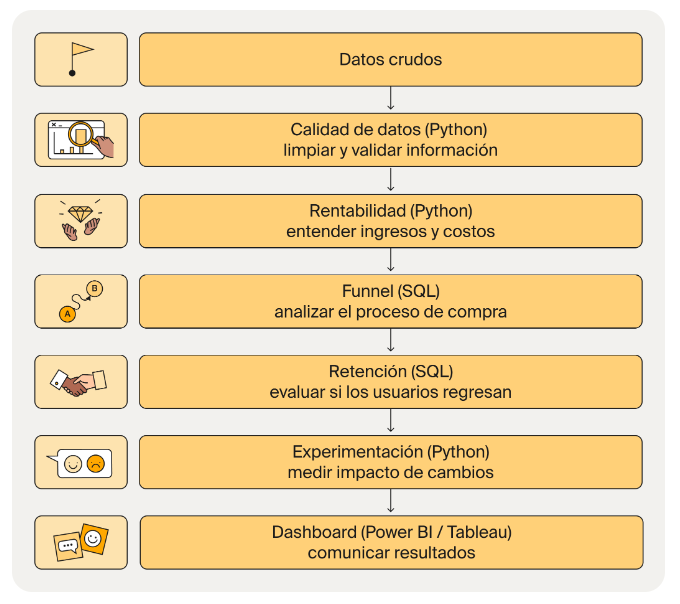

# 📊RappiPlus: De datos a decisiones de negocio.

RappiPlus es un servicio de suscripción dentro del ecosistema de Rappi diseñado para aumentar la frecuencia de compra y el valor generado por usuario.

Sin embargo, el equipo de negocio no tenía claro si el servicio estaba cumpliendo su objetivo.

Existían dudas clave:

¿Los usuarios realmente compran más?
¿El modelo está generando ganancias?
¿Se están perdiendo oportunidades en el proceso de compra?

Para responder estas preguntas, se trabajó con datos de pedidos, catálogo y marketing:

rappiplus_orders_raw.csv → información de pedidos, precios, descuentos y revenue
rappiplus_catalog.csv → costos de productos, categorías y proveedores
rappiplus_marketing_spend.csv → inversión en marketing por canal y país
events / users / user_activity (SQL) → comportamiento del usuario dentro de la plataforma
experiment_checkout_ui.csv → resultados de un experimento A/B en el checkout

## 🗺️ Diagrama general del proyecto

  

------------------------------------------------------------------------------------------------------------------------------------------------------------

## 💡 Insights de rentabilidad

#### 1. Rentabilidad: positiva, pero con presión estructural

El margen de 11.48% podría indicar que el negocio logra capturar valor, pero dentro de un rango relativamente ajustado.

En modelos tipo delivery, esto es relevante porque:

- los costos logísticos (última milla) son elevados
- las promociones y descuentos son frecuentes
- el costo de adquisición de clientes (CAC) es alto

#### 2. Estructura de costos: el principal punto de tensión

El hecho de que los costos representen aproximadamente 88.5% de los ingresos podría indicar una estructura intensiva en gasto.

Esto típicamente implicaría:

-fuerte inversión en marketing para sostener demanda -subsidios a usuarios (descuentos) -costos operativos/logísticos significativos

#### 3. ROI: crecimiento con eficiencia limitada

Un ROI de 12.97% podría indicar que la inversión genera retorno positivo, pero no de forma altamente eficiente.

Esto sugiere que el negocio está creciendo, pero no de forma orgánica completamente. Parte del crecimiento está siendo impulsado por inversión constante.

#### 4. Equilibrio crecimiento vs rentabilidad

Este tipo de negocio suele enfrentarse a una tensión estructural:

Crecer rápido → más marketing → menor margen

Optimizar rentabilidad → menos inversión → menor crecimiento

#### 5. Alta eficiencia en adquisición y monetización pero no en rentabilidad

El ROAS de 18.10 indica una alta eficiencia en la generación de ingresos a partir del gasto en marketing. Sin embargo, esta eficiencia no se traduce proporcionalmente en rentabilidad, como lo reflejan el margen del 11.48% y un ratio LTV/CAC de 2.08x.

Esto sugiere que, aunque el marketing está funcionando de manera sobresaliente, la estructura de costos operativos y logísticos limita la captura de valor.

#### 6. Dependencia comercial

El hecho de que un solo producto (LAPTOP-GAMING-16GB) concentre un volumen tan alto de ventas introduce riesgo de dependencia comercial. Esto podría afectar la estabilidad del ingreso si cambian las condiciones de ese producto (precio, disponibilidad o demanda).

#### 7. Dependencia de ingresos en wholesale frente a un retail de alto volumen pero bajo valor

Modelo híbrido donde coexisten dos dinámicas claramente diferenciadas: retail funciona como un motor de volumen y recurrencia, mientras que wholesale actúa como el principal generador de ingresos y flujo de caja. Esta dualidad implica que ambos segmentos cumplen roles estratégicos distintos dentro del negocio.

## ⚠️ Riesgos estratégicos

#### 1. Dependencia del gasto en marketing

Si el ROI no mejora:

- cada nuevo usuario cuesta relativamente caro
- el crecimiento puede volverse insostenible

#### 2. Escalabilidad limitada

Si los costos crecen al mismo ritmo que los ingresos, el negocio escala en volumen pero no en rentabilidad.

#### 3. Falsa sensación de eficiencia

Puede llevar a decisiones de sobreinversión en marketing. El peso operativo del segmento retail representa un riesgo de eficiencia. Aunque genera casi la totalidad de las transacciones, su baja contribución relativa a los ingresos sugiere que podría estar consumiendo recursos logísticos y operativos de forma intensiva sin una rentabilidad proporcional, lo que puede erosionar márgenes.

#### 4. Alta concentración de ingresos en el segmento wholesale

La dependencia de pocos clientes implica que la pérdida de uno o varios de ellos podría tener un impacto desproporcionado en los ingresos totales, afectando directamente la estabilidad financiera y el flujo de caja del negocio.

#### 5. Desbalance en la estrategia comercial

El alto volumen de retail puede llevar a enfocar esfuerzos en este segmento por su visibilidad operativa, mientras que wholesale, siendo el principal generador de ingresos, podría no estar recibiendo la atención estratégica necesaria en términos de gestión de cuentas, retención y crecimiento.

## 📝Recomendaciones

1. Optimizar la eficiencia del gasto en marketing Reevaluar la asignación del presupuesto de marketing enfocándose en canales y campañas con mayor rentabilidad.

2. Mejorar la rentabilidad unitaria antes de escalar Implementar iniciativas orientadas a incrementar el margen por cliente (pricing, reducción de costos logísticos, optimización operativa) antes de aumentar agresivamente la adquisición, asegurando que el crecimiento sea rentable.

2. Incremento del ticket promedio Optimizar el modelo operativo del segmento retail mediante automatización, mejora en ticket promedio y control de costos, con el objetivo de disminuir su carga operativa y mejorar su contribución al margen.

4. Diversificar la base de clientes wholesale Desarrollar estrategias de adquisición y retención para ampliar el portafolio de clientes wholesale, reduciendo la concentración de ingresos y mitigando el riesgo asociado a la pérdida de cuentas clave.

5. Implementar una estrategia comercial diferenciada por segmento Separar claramente la gestión de retail y wholesale:

Retail → eficiencia, automatización y escalabilidad Wholesale → gestión de cuentas, relaciones y crecimiento de valor

6. Priorizar la retención y expansión de clientes de alto valor Enfocar esfuerzos en maximizar el valor de clientes existentes (especialmente wholesale) mediante estrategias de upselling, fidelización y contratos de largo plazo.

------------------------------------------------------------------------------------------------------------------------------------------------------------

## 💡 Insights de conversión

El análisis del funnel muestra un volumen inicial de 7,796 usuarios en first_visit, con una conversión final de aproximadamente 27.4% hasta compra, lo cual indica que poco más de una cuarta parte de los usuarios completa el proceso. Las primeras etapas del funnel presentan un desempeño sólido, con una conversión del 88.6% de first_visit a select_item y 85.4% hacia add_to_cart, lo que sugiere que la propuesta de valor inicial y la exploración de productos funcionan adecuadamente.

Sin embargo, a partir de begin_checkout se observa una caída significativa en el comportamiento de los usuarios. El paso más crítico ocurre entre begin_checkout y add_payment_info, donde se registra el mayor abandono del funnel con un drop-off del 38.1%, equivalente a 1,600 usuarios. Esto indica que existe una fricción relevante en la etapa de pago, posiblemente relacionada con la experiencia de usuario, métodos de pago o percepción de seguridad. A pesar de esto, la conversión final de add_payment_info a purchase es relativamente alta (82.5%), lo que sugiere que una vez que el usuario ingresa su información de pago, la probabilidad de completar la compra es elevada.

## ⚠️ Riesgos estratégicos

El principal riesgo identificado es la fricción en la etapa de pago, específicamente antes de que los usuarios ingresen su información de pago. Este comportamiento puede estar impactando directamente los ingresos potenciales, ya que una proporción significativa de usuarios con alta intención de compra abandona en esta etapa crítica. Además, la caída relevante desde begin_checkout podría indicar problemas estructurales en el flujo de checkout, como procesos largos, falta de claridad en costos adicionales (envío, tarifas) o limitaciones en métodos de pago disponibles.

Otro riesgo es la posible pérdida de confianza del usuario en esta etapa final del funnel, lo cual podría afectar no solo la conversión inmediata, sino también la recurrencia futura. Si la experiencia de pago no es fluida, los usuarios podrían optar por alternativas competidoras con procesos más simples o transparentes.

## 📝Recomendaciones

Se recomienda priorizar la optimización del flujo de checkout, enfocándose especialmente en la transición de begin_checkout a add_payment_info. Algunas acciones clave incluyen simplificar el proceso de pago, reducir el número de pasos necesarios, mejorar la visibilidad de costos finales desde etapas tempranas y asegurar que los métodos de pago disponibles sean amplios y confiables para los usuarios.

Adicionalmente, sería valioso implementar análisis segmentados por variables como dispositivo, país o fuente de adquisición para identificar si la fricción está concentrada en ciertos grupos de usuarios. Esto permitiría diseñar soluciones más específicas y efectivas. Finalmente, se sugiere realizar pruebas A/B sobre mejoras en la experiencia de checkout, así como monitorear métricas de abandono en tiempo real para validar el impacto de los cambios implementados.

------------------------------------------------------------------------------------------------------------------------------------------------------------

## 💡 Insights de retención

El análisis de cohortes revela un patrón consistente en el comportamiento de retención de usuarios entre enero y mayo de 2025.

La retención en semana 1 se mantiene estable en torno al 41%–43%, lo que indica un buen nivel de activación inicial tras el registro. Sin embargo, se observa una caída significativa hacia la semana 2, donde la retención disminuye aproximadamente a 18%–21%, lo que implica la pérdida de más del 50% de los usuarios activos iniciales. Para la semana 3, la retención se reduce aún más a niveles cercanos al 8%–9%, mostrando que solo una pequeña proporción de usuarios mantiene un uso continuo del producto.

Adicionalmente:

No se observan mejoras progresivas entre cohortes, lo que sugiere ausencia de optimizaciones recientes en retención. El comportamiento es altamente consistente entre meses, indicando un patrón estructural más que un evento aislado.

## ⚠️ Riesgos Estratégicos

#### 1. Abandono temprano

Usuarios adquieren o prueban el servicio, pero no desarrollan hábito.

#### 2. Baja recurrencia en pedidos

El modelo pierde eficiencia porque: Menos pedidos → menor monetización → menor ROI del usuario

#### 3. Riesgo en ingresos por suscripción

Si los usuarios no perciben valor rápidamente:

- No existe retención de suscriptores
- Pérdida de ingresos recurrentes

#### 4. Ineficiencia en adquisición de usuarios

Con este nivel de churn temprano:

Gran parte del presupuesto de adquisición (marketing) se desperdicia

#### 5. Falta de diferenciación percibida

No hay mejoras visibles en la experiencia o el producto no está evolucionando en términos de engagement

## 📝Recomendaciones

1. Optimizar el onboarding para mejorar la retención en la semana 2.

2. Impulsar la activación temprana (primeros 7 días) mediante notificaciones push, emails de re-engagement e incentivos de uso inicial, con el objetivo de reducir la caída entre la semana 1 y la semana 2.

3. Identificar usuarios de alto valor. A partir del análisis de los usuarios que llegan a la semana 3, replicar sus patrones de comportamiento en nuevos usuarios.

4. Segmentar el análisis de retención por país, dispositivo y tipo de plan, para detectar los segmentos con mejor desempeño y escalar las estrategias más efectivas.

5. Implementar medición continua y experimentación mediante pruebas A/B en onboarding, comunicación y funcionalidades clave.

------------------------------------------------------------------------------------------------------------------------------------------------------------

## 🧾Test Estadístico

#### Hipótesis

##### H₀ (Hipótesis nula):

No hay diferencia en la tasa de conversión entre las variantes del checkout. (p_control = p_treatment)

##### H₁ (Hipótesis alternativa):

Sí hay diferencia en la tasa de conversión entre las variantes. (p_control ≠ p_treatment)

#### 📊Selección del test estadístico

Se utilizó un Z-test de proporciones debido a que la variable de interés (convirtio) es binaria y se comparan dos grupos independientes (variante). Además, el tamaño de muestra es suficientemente grande, lo que permite aplicar este test para evaluar si la diferencia en tasas de conversión es estadísticamente significativa.

#### 🧾 Conclusión

El p-value obtenido (0.416) es mayor que el nivel de significancia (α = 0.05), por lo tanto, no se rechaza la hipótesis nula. Esto indica que no existe evidencia estadísticamente significativa para afirmar que la variante del checkout tenga un impacto en la tasa de conversión. Las diferencias observadas entre los grupos pueden atribuirse al azar.

Aunque se observa una ligera diferencia entre variantes, esta no es estadísticamente significativa, por lo que no se recomienda implementar cambios basados en este experimento.

------------------------------------------------------------------------------------------------------------------------------------------------------------

## Dashboard PowerBI

Se creó un dashboard que muestra de manera clara y visual los resultados del análisis de ventas, costos, marketing y conversión.

Se usaron los CSVs:

orders_work.csv
catalog_work.csv
marketing_work.csv

#### Dashboard 1: Overview Ejecutivo

#### Dashboard 2: Detalle / Drill-through

